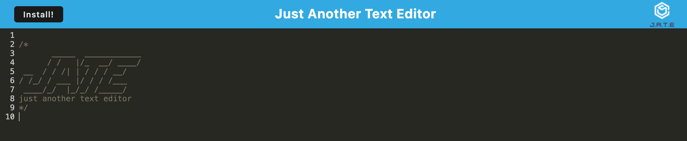
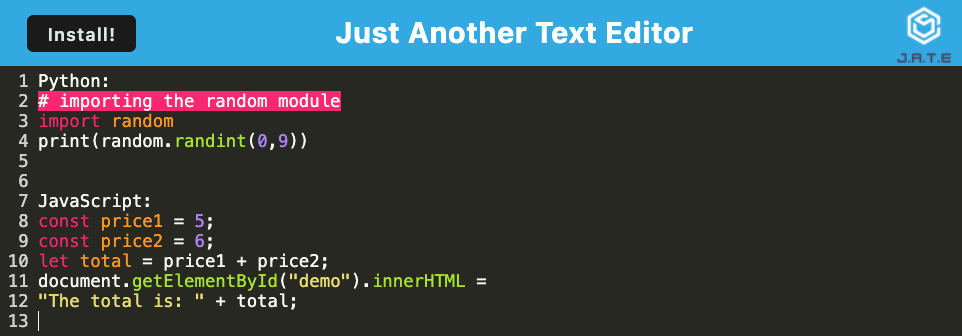

# infinite-edit

A web-based text editor with integrated web development features such as Webpack, IndexedDB, Service Worker, and Heroku deployment for efficient coding and development tasks.

## Overview

Welcome to Infinite-Edit, an innovative web application designed to simplify your note-taking and code editing experience. Infinite-Edit offers a seamless and user-friendly environment for capturing and editing your thoughts and code snippets effortlessly. Here's a sneak peek at what makes Infinite-Edit special:

- **Intuitive Interface:** Infinite-Edit features an intuitive user interface that makes it easy to start creating content from the moment you open the app.

- **PWA Installation:** You can install infinite-edit as a Progressive Web App (PWA) for quick access, whether you're on your computer or mobile device.

- **Offline Access:** Even when you're not connected to the internet, your content remains accessible, thanks to data persistence powered by IndexedDB.

- **Automatic Data Saving:** You won't have to worry about manually saving your work; infinite-edit takes care of that for you.

- **Structured Data Management:** The application uses a structured database to organize your notes and code snippets efficiently.

- **Code Editing:** Infinite-Edit is equipped with a versatile code editor, complete with syntax highlighting and other features to enhance your coding experience.

Infinite-Edit is your reliable companion for note-taking and code editing, offering a streamlined and feature-rich platform for your creative and productive endeavors. Explore more in the [Usage](#usage) section to get the most out of this innovative tool.

## Table of Contents

- [Description](#description)
- [Tools](#tools)
- [Technology Stack](#technology-stack)
- [Installation](#installation)
- [Usage](#usage)
- [Links](#links)
- [Credits](#credits)
- [Contributing](#contributing)
- [Report Issue](#report-issue)
- [License](#license)

## Description

Infinite-Edit is a dynamic web application designed to simplify and enhance your note-taking and code editing experience. It addresses the common need for a user-friendly platform to capture thoughts and edit code effortlessly. With features like offline access, automatic data saving, and a versatile code editor, infinite-edit empowers you to work seamlessly and manage your content efficiently.

Say goodbye to the hassles of manual saving and enjoy a structured, reliable solution for your creative and productive endeavors.

## Tools

Here are the essential tools you'll need to interact with Infinite-Edit effectively:

- **Web Browser:** Any modern web browser such as Chrome, Firefox, or Brave is suitable for using Infinite-Edit. A web browser is the gateway to accessing and using the application.

- **Internet Connection:** An internet connection is required for the initial setup and synchronization of your notes and code snippets. It enables real-time data transfer and ensures that your work is saved securely.

- **Node.js:** Node.js is a server-side JavaScript runtime that serves as the backbone for the server logic in Infinite-Edit. It enables server-side scripting and allows the application to handle requests and data processing.

## Technology Stack

### Root Directory

- **Node.js:** A server-side JavaScript runtime, used for server logic.
- **Express.js:** A web application framework for building server-side APIs and handling routes.
- **Nodemon:** Monitors code changes and automatically restarts the server during development.
- **Concurrently:** Allows running multiple commands concurrently, simplifying the development workflow.
- **if-env:** Helps manage environment variables for the project configuration.
- **Heroku:** A cloud platform used for deploying and hosting web applications.

### Server Side

- **Node.js:** The server runtime for handling server-side logic.
- **Express.js:** A web application framework for building server-side APIs.
- **Nodemon:** Automatically restarts the server during development for seamless debugging.
- **HTML (for client-side):** Used for rendering web pages on the client side, part of the server-side rendering process.

### Client Side

- **Node.js:** Used for managing client-side build tools and development dependencies.
- **Webpack:** A module bundler for the client-side code, optimizing and organizing assets.
- **Babel:** Transpiles modern JavaScript to ensure compatibility across browsers.
- **HTML Webpack Plugin:** Simplifies HTML file creation in the client-side build process.
- **Webpack Dev Server:** Provides a development server with live reloading for efficient client-side development.
- **Workbox Webpack Plugin:** Enables service worker integration and caching strategies for Progressive Web Apps (PWAs).
- **HTTP-Server:** A simple HTTP server used for serving static client-side files during development.
- **CSS Loaders:** Handles stylesheets in the client-side code, ensuring proper rendering.
- **HtmlWebpackPlugin:** Simplifies the creation of HTML files for the client-side build, enhancing the user interface.
- **Webpack PWA Manifest:** Manages Progressive Web App (PWA) features, making the application installable.
- **IDB:** IndexedDB, a client-side database for web applications, ensuring data persistence.
- **Code Mirror Themes:** Styles for the CodeMirror text editor used in the project, enhancing code editing and syntax highlighting.

## Installation

Follow these steps to install and set up infinite-edit on your device. Ensure you meet the prerequisites before proceeding.

### Prerequisites

Before you begin, make sure you have the following software installed on your computer:

- Web browser (e.g., Chrome, Firefox, Brave)
- Internet connection (for initial setup)
- [Node.js](https://nodejs.org/en) (for local development)

To set up infinite-edit for local development, follow these steps:

1. **Clone the Repository:**

   - Open your terminal or command prompt.
   - Navigate to the directory to install infinite-edit.
   - Run the following command to clone the repository:

     ```
     git clone git@github.com:Clkwong3/infinite-edit.git
     ```

2. **Install Dependencies:**

   - Navigate to the project directory:

     ```
     cd infinite-edit
     ```

   - Install project dependencies by running:

     ```
     npm install
     ```

3. **Start the Application:**

   - To start the server, run:

     ```
     npm start
     ```

   - Infinite-Edit should now be up and running.

4. **Access in Browser:**

   - Open any web browser and type http://localhost:3000 in the address bar to access the application.

   **Note:** If you're using a browser that supports Progressive Web Apps (PWAs), you can also install Infinite-Edit as a PWA for quick and easy access.
   Look for the "Install!" button in the navigation bar and click it to enjoy a seamless experience online or offline.

That's it! Infinite-Edit has been successfully installed into your device.

## Usage

Infinite-Edit is designed to be intuitive and user-friendly, making it easy to take notes and write code effectively.

1. **Getting Started:** Begin by opening Infinite-Edit in your web browser. The intuitive interface will greet you with an empty editor, ready for your content.
   

2. **Creating Content:** Start by typing or pasting your notes or code snippets into the editor. You'll find that the editor is well-equipped with features like syntax highlighting, line numbering, and automatic indentation to streamline your work.
   

3. **Automatic Saving:** You don't have to worry about saving your work manually. Infinite-Edit automatically saves your content as you go, ensuring that your progress is never lost.

4. **Offline Access:** Enjoy the flexibility of working offline. Even when you're not connected to the internet, your notes and code remain accessible.

5. **Structured Data Management:** Behind the scenes, infinite-edit uses a structured database to organize your content efficiently. This ensures a reliable and organized workspace.

6. **PWA Installation:** For quick and easy access, consider installing infinite-edit as a Progressive Web App (PWA) on your device. Look for the "Install!" button in the navigation bar and click it to enjoy a seamless experience.

   

   **Alternatively:** If you're using a browser that supports PWAs, you can also install infinite-edit as follows:

   - **Brave Browser:** Look for the PWA icon in the URL bar (as shown below) and click it to install Infinite-Edit as a PWA.

     

   - **Google Chrome:** Find the PWA icon in the URL bar (as shown below). Click it to install Infinite-Edit as a PWA for quick access.

     

That's all there is to it! You're now ready to make the most of Infinite-Edit on your device.

## Links

- [Deployed Site](https://pacific-gorge-55204-86517f95aead.herokuapp.com/): This link takes you to the live version of the web application, hosted on Heroku, where you can interact with the application's features and functionalities.

- [GitHub Repository](https://github.com/Clkwong3/infinite-edit): You can access the project's source code, contribute to development, and explore the codebase to understand how the application works.

- [Starter Code](https://github.com/coding-boot-camp/cautious-meme): This GitHub repository contains the starter code for this coding project. You can use this code as a foundation to kickstart your own development, saving time and effort in setting up the basic structure of your project.

## Credits

This project was developed by [Clarice Kwong](https://github.com/Clkwong3).

**Code Attribution:**

I'd like to recognize that this project uses code and concepts introduced during class, notably Activity 25 - 26 of Module 19 PWA. The lesson and demonstrations had a impact on how I worked on this project.

**Tutoring Session Influence:**

I'm grateful for the valuable guidance and insights I received during tutoring sessions. They helped me find solutions and improvements for this project.

## Contributing

If you'd like to contribute to the project with code or other contributions, here's how you can get started:

1. **Fork the Repository:** Start by forking the project's repository to your GitHub account.

2. **Clone the Repository:** Clone your forked repository to your local development environment.

   ```
   git clone git@github.com:Clkwong3/infinite-edit.git
   ```

3. **Create a New Branch:** Create a new branch for your contribution.

   ```
   git checkout -b feature/your-feature-name
   ```

4. **Make Changes:** Make your desired changes or contributions.

5. **Test Your Changes:** Ensure that your changes do not introduce any new issues and pass all existing tests.

6. **Commit Your Changes:** Commit your changes with a clear and concise commit message.

   ```
   git commit -m "Add feature: your feature description"
   ```

7. **Push to Your Repository:** Push your changes to your forked repository.

   ```
   git push origin feature/your-feature-name
   ```

8. **Create a Pull Request:** Go to the project's [Pull Requests](https://github.com/Clkwong3/infinite-edit/pulls) page, and click on "New Pull Request."

9. **Select the Base Branch:** Choose the appropriate base branch, typically the main branch of the project.

10. **Review and Submit:** Review your changes, provide a clear description of your contribution, and submit the pull request.

The project creator will review your pull request and provide feedback.

Thank you for your interest in contributing to the project!

## Report Issue

If you encounter any issues in the project, here's how you can get involved:

**Reporting Issues**

1. **GitHub Issues:** Visit the project's [GitHub Issues](https://github.com/Clkwong3/infinite-edit/issues) page.

2. **Search for Existing Issues:** Before creating a new issue, please search for existing ones to check if your concern has already been addressed.

3. **Create a New Issue:** If your issue isn't already listed, click on the "New Issue" button.

4. **Issue Title:** Use a descriptive and concise title that summarizes the problem.

5. **Issue Description:** In the issue description, provide the following details:

   - A clear and detailed explanation of the issue.
   - Steps to reproduce the problem if applicable.
   - Information about your environment, such as your operating system and any relevant software versions.

6. **Screenshots or Error Messages:** If you have visual aids, such as screenshots or error messages, please attach them to the issue.

7. **Labeling:** If you're familiar with labels or the issue tracking system on GitHub, you can add labels that best describe the issue. If not, don't worry; we'll handle that.

8. **Submit the Issue:** Click "Submit new issue," and the project creator will review it. We'll get back to you as soon as possible.

## License

This project is licensed under the MIT License - see the [LICENSE](https://github.com/Clkwong3/infinite-edit/blob/main/LICENSE) file for details.

[Top](#infinite-edit)
